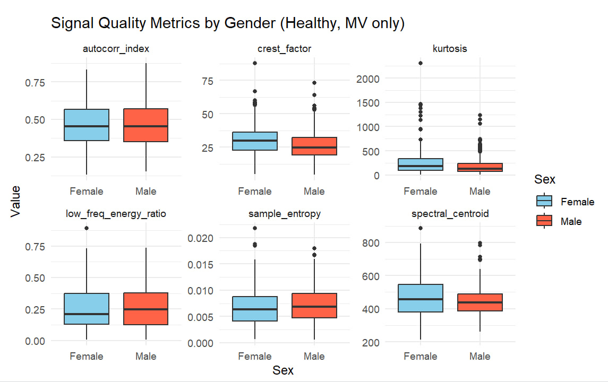

# initial_analysis-classification_heart_sounds
The goal of this project is to conduct an initial exploratory review of the PhysioNet Challenge dataset and existing literature to guide the development of a normalised high quality dataset for validating a novel heart sound recording device. 

# Overview

## 1.1 Background 
Advances in technology have created new opportunities to detect early signs of cardiac abnormalities via heart sound recordings (phonocardiograms) through machanical cardiac events (S1, S2, murmurs). These signals are analyzed with mordern signal processing, and can be used in predicting models (with machine learning techniques) to spport screening and triage in low resource settings. 

Until this current PhysioNet Challenge, there was no signficiant open source heart sound database available for researchers to train and evaluate algorithms. This challenge was initially set up to encourage the development of algorithms to classify heart sound recordings, identify murmur presence and detect pathology across diverse recording environments. This is done via a single recording in a precordial location.

For a novel asculation devices, there is a need to create clean, standardised and demographically representative normative dataset. This will provide a reliable baseline for comparison, and a ground truth for future models.

## 1.2 Objectives: 
* Identify predictive features to be included in the model
* Identify risk factors relevant to prediction outcomes
* Identify elements that can or cannot be generalised to a new device context

## 1.3 Scope and Limitation
The data is compiled from multiple research groups across the world, recorded in different real world clinical and nonclinical environments (home visits), depending on individual protocols. It includes not only clean heart sounds, but also some noisy (poor quality) recordings. Recordings were done at the the aortic, pulmonic, tricuspid and mitral area. 
(? short summary of how wavesound files was converted into numerical values) 
(? explanation on signal metrics chosen) 

Patient demographics were merged with the cleaned dataset, joined on `Patient ID`. There are multiple recordings for some patients- only the first value will be taken. 

# 2. Exploratory Data Exploration 

## 2.1 IDA 
There are 894 distinct observations (456 healthy, 437 diseased), with 455 females (66 pregnant) and 438 males. The dataset is a pediatric population- consisting of adolescents (71), child (625), infant (121) and neonates (6). There are four murmur quality recorded- blowing (73), harsh (94), muscial (4). Lastly, there are 4 valve sites being recorded- MV (808), AV (745), PV (721), TV (681). There are no missing values in this dataset. 

## 2.2 Murmurs 
|Outcome|Murmur|Proportion|
|-------|------|----------|
|Healthy|Absent|88%|
|       |Present|6%|
|Diseased|Absent|58%|
|        |Present|33%|

Interestingly, there remains a large population of those with murmurs absent in the diseased population. This suggests that murmurs needs to be used in combination with other variables as a predictive factor. 

## 2.3 Distribution of signal metrics 
 

Distributions for both groups are largely similar

# 3. Statistical and graphical Comparison 

## 3.1 Preliminary Evaluation of Feature Discrepency 

The Wilcoxon rank sum test was used to determine if there was a signficant difference in signal metrics between groups. In other words, are there metrics that are able to distinguish between the diseased and healthy population? 

Overall, temporal and complexity based features (kurtosis, crest factor, autocorrelation index and sample entropy) show statistically significant difference between groups. On the other hand, frequency based features (spectral centroid, low- frequency ratio) did not show difference between groups, suggesting they may not be strong discriminators. 

High frequency content in te heart is indicative of turbulent blood flow (stenosis, mitral regurgitation) and murmurs. This suggests that the device may not have been able to capture murmurs, potentially due to the noisy environment. This also correlates with previous findings where there remains a large population of disased individuals presenting with n absence of murmurs. 

## 3.2 Freature discrepency in demographics in the healthy population  

### 3.2.1 Gender 

Across all features, males and females have overlapping distributions with no large shifts in medians. Crest factor and kurtosis shows more extreme outliers in males, but the central tendency remains similar. 
Deviations in outliers may be due to males having a thicker chest wall, or inconsistent stethoscope placement in individuals. 

Given a similar distribution, the device can assume gender invariant signal features, meaning that it can be interpreted the same way. Also, gender will not be a confounding factor. 

### 3.2.2 Age 

Clear age-related differences were observed across several acoustic features. Infants and young children consistently showed lower kurtosis and crest factor values, higher spectral centroids, and reduced low-frequency energy ratios compared with adolescents. These patterns align with known physiological differences in younger patients, including smaller cardiac structures, higher heart rates, and thinner chest walls, all of which tend to produce softer S1/S2 sounds and relatively greater high-frequency transmission. 

The findings indicate that age has a meaningful influence on heart-sound characteristics even in healthy individuals, underscoring the need for age-specific normative ranges—particularly for infants—to ensure accurate device validation and avoid misclassification driven by normal developmental physiology.

